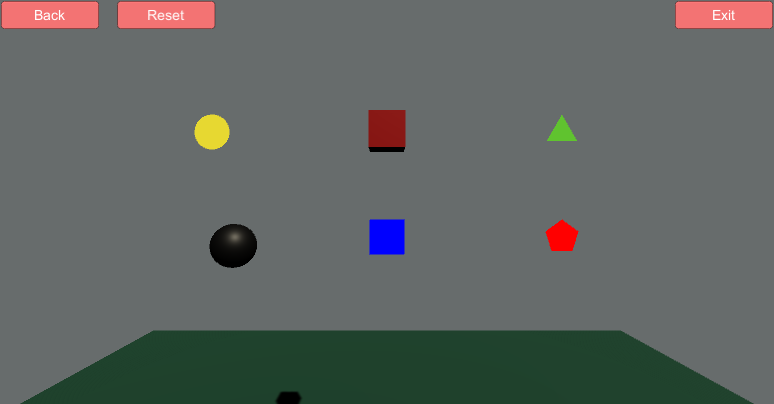

# Shape-Manipulator


This project is a computer graphics assignment implemented using Unity3D. It allows users to draw, manipulate (rotate, scale, translate), and interact with various 2D and 3D shapes. The project consists of two main scenes and provides both keyboard input and button-based interactions for a seamless user experience.

## Features

### 1. Load Scene
- This is the introductory scene where the app’s guidelines and instructions are displayed.
- **Start Button**: Click this button to move to the main scene.

### 2. Main Scene
- The main scene allows users to draw shapes and perform various transformations on them.
  
#### Available Shapes:
- **Press '1'** to Draw a **Circle**
- **Press '2'** to Draw a **3D Cube**
- **Press '3'** to Draw a **Triangle**
- **Press '4'** to Draw a **Ball**
- **Press '5'** to Draw a **Square**
- **Press '6'** to Draw a **Polygon**

#### Available Operations:
- **Press 'R'** to **Rotate** the shape.
- **Press 'S'** to **Scale** the shape.
- **Press 'T'** to **Translate** the shape.

#### Additional Features:
- **Left-click** on any shape to display its position in 3D space.
- **Click on any shape** to bring up a list of **color buttons** (circular buttons) that allow you to change the color of the selected shape.
- **Press 'i'** to take a screenshot of the current scene.

#### Additional Buttons:
- **Back Button**: Returns to the Load Scene.
- **Reset Button**: Resets the scene, clearing all shapes and reverting transformations.
- **Exit Button**: Closes the application.

## Development Tools

- **Unity3D** : Used to implement the project, manage the scenes, and handle user inputs.
- **C#**: Programming language used for scripting in Unity.

## Screenshots :
Here are some screenshots of the app in action:

### Load Scene


### Main Scene


### Main Scene After Pressed `1` `2` `3`


### Main Scene After Pressed `1` `2` `3` `4` `5` `6`



### Main Scene After Pressed `Right Click` on the **Triangle** 
then Change the Color of the **Triangle** to Red Color.


### Main Scene After Pressed `Left Click` on the **3D Cube**
it Shows the Position of The **3D Cube** in 3D space .


### Main Scene After Pressed `T`
it Translate the Position of The Shapes by 10 on the X Axis in 3D space .


### Main Scene After Pressed `S`
it Scales The Shapes in 3D space .


### Main Scene After Pressed `R`
it Rotates The Shapes in 3D space .


---

## Project Structure
This project contains the following key files and folders:

- **Assets/**: This folder contains all the assets used in the Unity project such as scripts, scenes, prefabs, models, and textures.
  - **Scenes/**: Contains the `LoadScene` and `MainScene`, which are the core scenes of the project.
  - **Scripts/**: Contains the C# scripts that handle shape creation, transformations (rotate, scale, translate), and UI interactions.
  - **Prefabs/**: Stores prefabricated objects (shapes like Circle, Cube, Triangle, etc.) used in the main scene.
  
--- 

## Installation and Usage

### Prerequisites
- **Unity3D**: Make sure you have Unity3D installed. You can download it from [Unity's official website](https://unity.com/).

### Steps to Run the Project:
1. **Clone this repository**:
   ```
   git clone https://github.com/Izzat-Kawadri/Shape-Manipulator.git
   ```
2. **Open the Project**:
     1. Open Unity Hub.
     2. Click Add and select the folder where you cloned the project.
     3. Open the project in Unity.

3. **Run the Application**:
        Once the project is loaded in Unity, click on the Play button to run the application inside the Unity editor.

### Building the Project:

To create an executable version of the project:

  1. Go to File > Build Settings in Unity.
  2. Select your target platform (e.g., PC, Mac, Linux, or WebGL).
  3.  Click Build and choose a directory to save the build.

--- 

## Download
You can download the build of the app for Windows and Linux platforms from the links below:

- [Download for Windows ](./Shape_Manipulator.zip)  


## Running the Executable:
- Download the build for your platform from the Downloads section.
- Extract the files and run the executable:
   - On Windows, double-click the .exe file to start the application.
   

## License

This project is licensed under the MIT License - see the LICENSE file for details.

--- 

## Contribution

Feel free to contribute to this project by submitting issues, feature requests, or pull requests!
